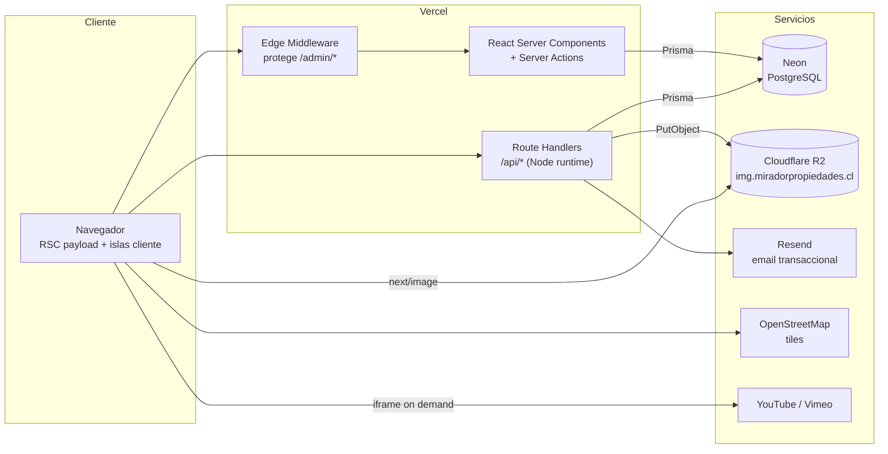
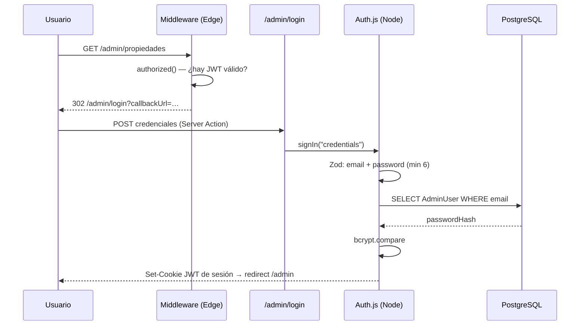
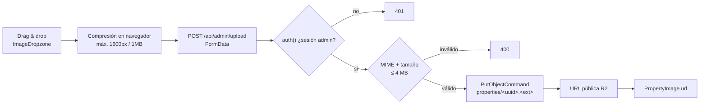
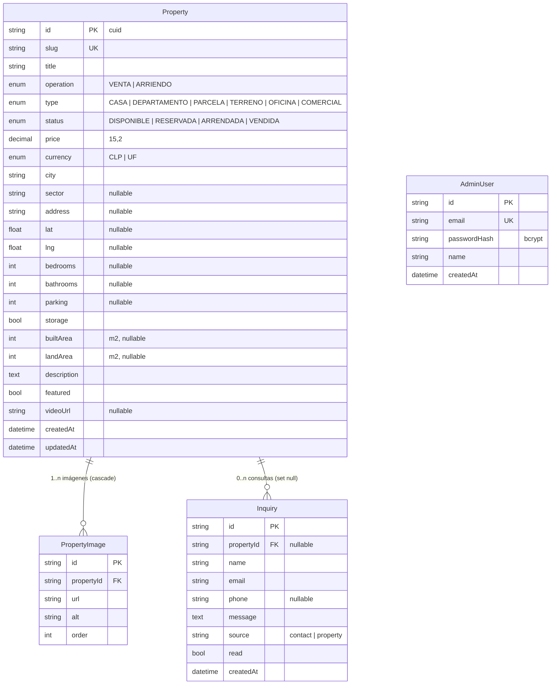

<div align="center">

# Mirador Propiedades

**Sitio público y panel de administración de [miradorpropiedades.cl](https://www.miradorpropiedades.cl)**
Corredora de propiedades boutique en el sur de Chile.

[](https://nextjs.org)
[](https://react.dev)
[](https://www.typescriptlang.org)
[](https://www.prisma.io)
[](https://neon.tech)
[](https://tailwindcss.com)
[](https://authjs.dev)
[](https://vercel.com)

</div>

---

## Tabla de contenidos

1. [Visión general](#1-visión-general)
2. [Entornos y URLs](#2-entornos-y-urls)
3. [Funcionalidades](#3-funcionalidades)
4. [Stack tecnológico](#4-stack-tecnológico)
5. [Arquitectura](#5-arquitectura)
6. [Estructura del repositorio](#6-estructura-del-repositorio)
7. [Modelo de datos](#7-modelo-de-datos)
8. [Seguridad](#8-seguridad)
9. [Rendimiento y SEO](#9-rendimiento-y-seo)
10. [Accesibilidad](#10-accesibilidad)
11. [Sistema de diseño](#11-sistema-de-diseño)
12. [Puesta en marcha local](#12-puesta-en-marcha-local)
13. [Variables de entorno](#13-variables-de-entorno)
14. [Scripts](#14-scripts)
15. [Despliegue](#15-despliegue)
16. [Calidad de código](#16-calidad-de-código)
17. [Limitaciones conocidas y deuda técnica](#17-limitaciones-conocidas-y-deuda-técnica)
18. [Documentación adicional](#18-documentación-adicional)
19. [Licencia](#19-licencia)

---

## 1. Visión general

Aplicación web full-stack construida sobre **Next.js 15 (App Router)** que cumple dos funciones:

- **Sitio público** — catálogo de propiedades con búsqueda y filtros, fichas con galería, video y mapa, y captación de leads por formulario y WhatsApp.
- **Panel de administración** — CRUD completo del catálogo con subida de imágenes, geolocalización asistida y bandeja de consultas, operable por la corredora sin intervención técnica.

El proyecto reemplazó un sitio genérico previo con tres objetivos: identidad visual editorial propia, autonomía total de publicación y SEO técnico sólido desde la base.

**Características arquitectónicas destacadas:**

- Renderizado en servidor por defecto (React Server Components), sin capa de fetching en cliente ni API interna para lectura de datos.
- *Streaming* con `<Suspense>` y esqueletos de carga por ruta: el shell editorial se pinta al instante y los datos llegan progresivamente.
- Mutaciones vía **Server Actions** con revalidación on-demand de las rutas públicas afectadas.
- Degradación elegante: toda consulta a base de datos está encapsulada en `try/catch`; si Postgres no responde, el sitio renderiza sin datos en lugar de caer con error 500.
- Autenticación con configuración dividida Edge/Node para que el middleware pueda correr en Edge Runtime sin arrastrar Prisma ni bcrypt.

---

## 2. Entornos y URLs

| Entorno | URL | Notas |
|---|---|---|
| Producción — sitio | https://www.miradorpropiedades.cl | Hosting en Vercel |
| Producción — admin | https://www.miradorpropiedades.cl/admin | Requiere sesión; `noindex` |
| CDN de imágenes | https://img.miradorpropiedades.cl | Cloudflare R2 con dominio propio |
| Local — sitio | http://localhost:3000 | `npm run dev` |
| Local — admin | http://localhost:3000/admin/login | |

---

## 3. Funcionalidades

### 3.1 Sitio público

| Ruta | Descripción |
|---|---|
| `/` | Hero a pantalla completa con carrusel de portada, buscador rápido, propiedades destacadas (streaming), teaser de servicios y CTA final. |
| `/propiedades` | Catálogo directo (sin encabezado editorial) con filtros de operación, tipo y comuna, ordenamiento y paginación. |
| `/propiedades/[slug]` | Ficha completa: galería con lightbox, video, mapa, especificaciones, formulario de consulta y propiedades similares. |
| `/servicios` | Seis servicios detallados + proceso de trabajo en cuatro pasos. |
| `/nosotros` | Presentación de la corredora (`/nosotras` redirige aquí de forma permanente). |
| `/contacto` | Datos de contacto directo (email, teléfono, WhatsApp, Instagram) + formulario. |
| `/sitemap.xml`, `/robots.txt` | Generados dinámicamente desde la base de datos. |
| `404` | Página no encontrada con diseño propio. |

**Detalle funcional:**

- **Buscador del home** — pestañas Comprar/Arrendar, selector de comuna (poblado dinámicamente solo con comunas que tienen inventario real) y tipo de propiedad; redirige al catálogo con los filtros ya aplicados.
- **Filtros del catálogo** — operación, tipo de propiedad, comuna y orden (recientes · precio ascendente · precio descendente); en móvil se suma el rango de precio. Todo el estado vive en la URL (`?op=VENTA&comuna=Frutillar&tipo=CASA`), por lo que cualquier búsqueda es **compartible y marcable**. En escritorio la barra de filtros es inline; en móvil se abre como *bottom sheet* con contador de filtros activos. Los selectores de dormitorios, baños y estado se retiraron de la interfaz en septiembre de 2026 a pedido de la dueña; `buildWhere()` sigue entendiendo esos parámetros para no romper enlaces antiguos.
- **Paginación** — 12 propiedades por página, con navegación que preserva todos los filtros activos.
- **Estado por defecto** — el catálogo muestra propiedades `DISPONIBLE` y `RESERVADA` salvo que se filtre explícitamente por estado.
- **Galería** — mosaico de 1 + 4 imágenes con lightbox (navegación por teclado y gestos táctiles).
- **Video** — soporte para YouTube y Vimeo con patrón *facade*: se muestra la portada con botón de play y el `iframe` de terceros solo se monta al hacer clic, evitando el costo de carga del reproductor externo. YouTube se incrusta vía `youtube-nocookie.com`.
- **Mapa** — Leaflet + OpenStreetMap, cargado dinámicamente sin SSR, con ubicación referencial de la propiedad.
- **Propiedades similares** — hasta tres del mismo tipo, excluyendo la actual.
- **Captación de leads** — formulario validado en cliente y servidor, con honeypot antibots; la consulta se persiste en base de datos y se notifica por email. Botón de WhatsApp con mensaje pre-armado que incluye título y URL de la propiedad.
- **Precios** — formateo localizado `es-CL` para CLP (con separador de miles) y UF.

### 3.2 Panel de administración

| Ruta | Descripción |
|---|---|
| `/admin/login` | Autenticación por email + contraseña. |
| `/admin` | Dashboard: propiedades por estado, consultas de los últimos 7 días, últimas 5 consultas y accesos rápidos. |
| `/admin/propiedades` | Tabla completa con operación, tipo, precio, estado y número de consultas por propiedad. |
| `/admin/propiedades/nueva` | Alta de propiedad. |
| `/admin/propiedades/[id]` | Edición y eliminación, con enlace directo a la ficha pública. |
| `/admin/inquiries` | Bandeja de leads con propiedad asociada, email y teléfono clicables. |

**Detalle funcional:**

- **Formulario de propiedad** — cubre todos los campos del modelo, validado con el mismo esquema Zod que usa el servidor.
- **Geolocalización asistida** — tres vías intercambiables para fijar coordenadas: pegar un enlace de Google Maps (largo o corto — los cortos se resuelven en servidor siguiendo la redirección), hacer clic o arrastrar el pin en un mapa interactivo, o escribir latitud/longitud a mano.
- **Imágenes** — *drag & drop* múltiple con compresión en el navegador (máx. 1600 px / ~1 MB) antes de subir a Cloudflare R2; vista previa, texto alternativo obligatorio por imagen y orden explícito.
- **Video** — campo opcional que acepta cualquier formato de enlace de YouTube (`watch?v=`, `youtu.be`, `/embed/`, `/shorts/`, `/live/`) o Vimeo (incluidos enlaces privados con hash), validado en el momento de guardar.
- **Destacadas** — interruptor que controla qué propiedades aparecen en el home.
- **Slugs** — se generan automáticamente desde el título; ante colisión se añade un sufijo corto derivado del timestamp.
- **Revalidación automática** — toda mutación revalida `/`, `/propiedades` y la ficha afectada, de modo que el sitio público refleja el cambio de inmediato.

---

## 4. Stack tecnológico

### Núcleo

| Capa | Tecnología | Versión | Rol |
|---|---|---|---|
| Framework | Next.js (App Router) | 15.1 | SSR/ISR, streaming, Server Actions, route handlers |
| UI | React | 19 | Server + Client Components |
| Lenguaje | TypeScript | 5.6 | `strict: true`, alias `@/*` |
| Estilos | Tailwind CSS | 3.4 | Design tokens vía variables CSS |
| ORM | Prisma | 5.22 | Schema, migraciones, cliente tipado |
| Base de datos | PostgreSQL (Neon) | — | Serverless con pooling |
| Autenticación | Auth.js / NextAuth | 5.0.0-beta.25 | Credentials + JWT |
| Hosting | Vercel | — | Build, CDN, Edge middleware |

### Servicios externos

| Servicio | Uso | SDK |
|---|---|---|
| Cloudflare R2 | Almacenamiento de imágenes (S3-compatible, egreso gratuito) | `@aws-sdk/client-s3` 3.x |
| Resend | Email transaccional de consultas | `resend` 4.x |
| OpenStreetMap | Tiles de los mapas | — |
| YouTube / Vimeo | Embebido de videos de propiedades | — |
| Google Fonts | Cormorant Garamond + Montserrat vía `next/font` | — |

### Librerías de aplicación

| Paquete | Uso |
|---|---|
| `react-hook-form` + `@hookform/resolvers` + `zod` | Formularios y validación compartida cliente/servidor |
| `bcryptjs` | Hash de contraseñas del admin |
| `react-leaflet` + `leaflet` | Mapa de la ficha y selector de ubicación del admin |
| `yet-another-react-lightbox` | Galería a pantalla completa |
| `react-dropzone` + `browser-image-compression` | Subida y compresión de imágenes en el cliente |
| `sonner` | Notificaciones toast |
| `lucide-react` | Iconografía (TikTok se define como SVG inline propio) |
| `slugify` | Generación de slugs |
| `class-variance-authority`, `clsx`, `tailwind-merge` | Variantes y composición de clases |
| `@radix-ui/react-slot` | Polimorfismo `asChild` del componente `Button` |

> **Nota de precisión:** `@auth/prisma-adapter` y los paquetes Radix `react-dialog`, `react-select`, `react-label` y `react-toast` figuran en `package.json` pero **no se usan** actualmente (la sesión es JWT y los diálogos/selects son implementaciones propias). Ver [deuda técnica](#17-limitaciones-conocidas-y-deuda-técnica).

---

## 5. Arquitectura

### 5.1 Vista de sistema



### 5.2 Estrategia de renderizado y caché

| Ruta | Tipo | Caché | Invalidación |
|---|---|---|---|
| `/` | RSC con `<Suspense>` para destacadas | ISR `revalidate = 300` | `revalidatePath("/")` en cada mutación |
| `/propiedades` | Dinámica (depende de `searchParams`) | Sin caché de página | — |
| `/propiedades/[slug]` | RSC | ISR `revalidate = 300` | `revalidatePath` al crear/editar/eliminar |
| `/servicios`, `/nosotros`, `/contacto`, `404` | Estáticas | Prerender en build | Redeploy |
| `/sitemap.xml` | RSC | `revalidate = 3600` | — |
| `/robots.txt` | Estático | Build | — |
| `/admin/**` | Dinámica, `robots: noindex` | Sin caché | — |
| `/api/contact` | Route handler (Node) | — | — |
| `/api/admin/upload` | Route handler (`runtime = "nodejs"`) | — | — |
| `/api/auth/[...nextauth]` | Route handler (`runtime = "nodejs"`) | — | — |

**Streaming.** Las páginas pesadas separan el shell del contenido: `/propiedades` renderiza su encabezado mínimo de inmediato y transmite `PropertiesResults` (filtros + grilla) cuando la consulta resuelve; el home hace lo mismo con `FeaturedSection`. Cada ruta con datos tiene además su `loading.tsx` con esqueletos que replican la maquetación final, evitando saltos de layout.

**Deduplicación.** La ficha de propiedad envuelve su consulta en `cache()` de React, de modo que `generateMetadata` y el componente de página comparten un único `SELECT` por request.

### 5.3 Flujo de autenticación



La configuración se divide en dos archivos deliberadamente:

- `src/lib/auth.config.ts` — **Edge-safe**: solo callbacks y rutas, sin importar Prisma ni bcrypt. Es lo que consume `middleware.ts`.
- `src/lib/auth.ts` — configuración completa con el provider de credenciales, Prisma y bcrypt; se usa en Server Components, Server Actions y route handlers.

### 5.4 Pipeline de imágenes



Formatos aceptados: **JPEG, PNG, WebP, AVIF**. El límite duro de 4 MB responde al tope de cuerpo de request de los route handlers en Vercel; la compresión previa en el cliente hace que ese techo casi nunca se alcance. Las imágenes se sirven después con `next/image` desde `img.miradorpropiedades.cl`, dominio declarado en `remotePatterns` de `next.config.ts`.

### 5.5 Flujo de consultas (leads)

1. `ContactForm` valida con Zod en el cliente y hace `POST /api/contact`.
2. El route handler **revalida el mismo esquema en servidor** (nunca confía en el cliente).
3. Si el honeypot `website` viene relleno, responde `200` sin efectos: el bot cree que tuvo éxito.
4. Persiste el `Inquiry` en base de datos, con `source` = `"property"` o `"contact"`.
5. Envía el email vía Resend con `replyTo` apuntando al consultante, de modo que responder desde el correo escribe directo al cliente.
6. Si la base de datos falla, **igual intenta enviar el email** para no perder el lead; si falta `RESEND_API_KEY`, la consulta queda igualmente guardada.

---

## 6. Estructura del repositorio

```
webMirador/
├── prisma/
│   ├── migrations/                     # 3 migraciones SQL versionadas
│   ├── schema.prisma                   # Modelo de datos y enums
│   ├── seed.ts                         # 8 propiedades demo + usuario admin
│   └── set-admin-password.ts           # Script de rotación de contraseña
├── public/
│   └── logo-mirador.png
├── referencias/                        # Guía de estilo y logotipos originales
├── src/
│   ├── app/
│   │   ├── layout.tsx                  # Fuentes, metadata base, Header/Footer, Toaster, skip-link
│   │   ├── page.tsx                    # Home
│   │   ├── loading.tsx                 # Esqueleto global
│   │   ├── not-found.tsx               # 404
│   │   ├── globals.css                 # Tokens, tipografía display, utilidades, overrides Leaflet
│   │   ├── sitemap.ts  robots.ts       # SEO dinámico
│   │   ├── icon.svg  apple-icon.png  favicon.ico
│   │   ├── propiedades/
│   │   │   ├── page.tsx                # Shell del catálogo
│   │   │   ├── PropertiesResults.tsx   # Query, filtros, grilla y paginación (streaming)
│   │   │   ├── loading.tsx
│   │   │   └── [slug]/{page,loading}.tsx
│   │   ├── contacto/  servicios/  nosotros/
│   │   ├── api/
│   │   │   ├── auth/[...nextauth]/route.ts
│   │   │   ├── contact/route.ts
│   │   │   └── admin/upload/route.ts
│   │   └── admin/
│   │       ├── layout.tsx  loading.tsx  page.tsx
│   │       ├── login/page.tsx
│   │       ├── inquiries/page.tsx
│   │       └── propiedades/
│   │           ├── page.tsx  actions.ts
│   │           ├── nueva/page.tsx
│   │           └── [id]/page.tsx
│   ├── components/
│   │   ├── home/      Hero · HeroCarousel · SearchBar · FeaturedSection · FeaturedGrid · ServicesTeaser
│   │   ├── property/  PropertyCard · Filters · Gallery · VideoEmbed · MapView · PropertyDetailMap
│   │   │              LocationPickerMap · PriceTag · StatusBadge
│   │   ├── layout/    Header · Footer
│   │   ├── forms/     ContactForm · PropertyForm · ImageDropzone
│   │   └── ui/        Button · Input · Badge · Logo · Reveal · Skeleton · NavigationProgress
│   ├── lib/
│   │   ├── auth.ts  auth.config.ts     # Auth.js dividido Node/Edge
│   │   ├── prisma.ts                   # Singleton del cliente
│   │   ├── r2.ts                       # Cliente S3 y URLs públicas
│   │   ├── validations.ts              # Esquemas Zod compartidos
│   │   ├── email.ts                    # Plantilla HTML + envío con Resend
│   │   ├── maps.ts                     # Parseo de coordenadas desde Google Maps
│   │   ├── video.ts                    # Parseo de enlaces YouTube/Vimeo
│   │   ├── cities.ts                   # Comunas con inventario real
│   │   ├── formatters.ts               # CLP/UF, m², etiquetas de enums
│   │   ├── whatsapp.ts  social.tsx     # Canales de contacto y redes
│   │   ├── leaflet-icon.ts  utils.ts
│   ├── types/property.ts               # Tipos derivados de Prisma
│   └── middleware.ts                   # Matcher /admin/:path*
├── docs/
│   ├── ARQUITECTURA.md                 # Referencia técnica profunda
│   └── OPERACION.md                    # Runbook de despliegue y mantenimiento
├── PROYECTO.md                         # Dossier de negocio y contexto
├── next.config.ts  tailwind.config.ts  tsconfig.json  .eslintrc.json
└── .env.example
```

---

## 7. Modelo de datos



**Índices.** `Property(operation, type, city, status)` compuesto para los filtros del catálogo y `Property(featured)` para el home; `PropertyImage(propertyId, order)` para traer portadas ordenadas; `Inquiry(createdAt)` e `Inquiry(read)` para la bandeja.

**Integridad referencial.** Las imágenes se borran en cascada con la propiedad; las consultas sobreviven con `propertyId = NULL`, preservando el historial comercial aunque la propiedad se retire.

**Precisión monetaria.** `price` es `Decimal(15,2)`. Como `Decimal` no es serializable hacia Client Components, se convierte a `string` en el borde servidor→cliente mediante el tipo `PropertyCardData`.

**Migraciones aplicadas:**

| Migración | Contenido |
|---|---|
| `20260519012346_init` | Esquema inicial completo |
| `20260706015604_add_comercial_property_type` | Nuevo valor `COMERCIAL` en `PropertyType` |
| `20260720023913_add_property_video` | Columna `Property.videoUrl` |

---

## 8. Seguridad

| Vector | Mitigación |
|---|---|
| Acceso al panel | Middleware en Edge sobre `/admin/:path*`; redirección a login sin sesión válida |
| Autorización en mutaciones | Cada Server Action llama a `requireAdmin()` como primera instrucción — la protección no depende solo del middleware |
| Autorización en upload | `POST /api/admin/upload` verifica `auth()` antes de leer el `FormData` |
| Contraseñas | Hash bcrypt (coste 10); sin registro público; usuarios creados por seed o script |
| Sesiones | JWT firmado con `AUTH_SECRET`, sin tabla de sesiones |
| Inyección SQL | Prisma con consultas parametrizadas; sin SQL crudo en el código |
| Entrada no confiable | Validación Zod en cliente **y** servidor para contacto y propiedades |
| Spam de formularios | Campo honeypot oculto; respuesta `200` silenciosa al detectarlo |
| Open redirect | El `callbackUrl` del login se acepta solo si empieza con `/` y no con `//` |
| Subida de archivos | Allow-list de MIME types, tope de 4 MB, nombre de objeto generado con `crypto.randomUUID()` (nunca el nombre del usuario) |
| XSS en emails | Escapado explícito de todos los campos interpolados en la plantilla HTML |
| Clickjacking / sniffing | Cabeceras `X-Frame-Options: DENY`, `X-Content-Type-Options: nosniff`, `Referrer-Policy: strict-origin-when-cross-origin` |
| Indexación del admin | `robots.ts` bloquea `/admin` y `/api`; cada página del panel declara `robots: { index: false }` |
| Fuga de secretos | `.env` fuera de control de versiones; el seed **falla** si no se define `SEED_ADMIN_PASSWORD` en lugar de usar un valor por defecto |
| Privacidad en embebidos | YouTube se sirve por `youtube-nocookie.com` |

---

## 9. Rendimiento y SEO

**Rendimiento**

- Server Components por defecto: el JavaScript enviado al cliente se limita a las islas interactivas (filtros, galería, mapas, formularios, carrusel).
- `<Suspense>` + `loading.tsx` en todas las rutas con datos: *First Contentful Paint* independiente de la latencia de la base de datos.
- `NavigationProgress`: barra de progreso propia, sin dependencias, que reacciona al clic en cualquier enlace interno mediante un listener en fase de captura y se completa al cambiar la ruta — feedback inmediato incluso en rutas estáticas.
- `next/image` en todo el sitio, con `sizes` explícitos por breakpoint y `priority` solo en el hero y la imagen principal de la galería.
- Facade de video: el reproductor de terceros no se carga hasta que la persona pulsa play.
- Mapas Leaflet importados con `next/dynamic` y `ssr: false`, con esqueleto mientras montan.
- Fuentes autoalojadas por `next/font/google` con `display: swap` y variables CSS, sin FOUT ni layout shift.
- Consulta de ficha deduplicada con `cache()`; consultas del catálogo paralelizadas con `Promise.all`.
- Singleton de Prisma para evitar agotar el pool en desarrollo con hot reload.
- Índices compuestos alineados con los filtros reales del catálogo.

**SEO**

- `metadataBase` con validación defensiva de `NEXT_PUBLIC_SITE_URL` (si es inválida, cae a un fallback en lugar de romper el build).
- Plantilla de títulos `%s · Mirador Propiedades`, descripciones y keywords por página.
- Open Graph con `locale: es_CL`; la ficha de propiedad usa su primera imagen como imagen social.
- `sitemap.xml` generado desde la base de datos con `lastModified` real por propiedad, degradando a las rutas estáticas si Postgres no responde.
- `robots.txt` dinámico con referencia al sitemap.
- URLs semánticas por slug y jerarquía de encabezados correcta con migas de pan.
- `lang="es-CL"` en el documento raíz.

---

## 10. Accesibilidad

- Enlace **«Saltar al contenido»** visible al enfocar con teclado.
- Anillos de foco visibles y consistentes (`:focus-visible` global, sin suprimir el outline).
- Texto alternativo **obligatorio** en cada imagen de propiedad, validado por Zod en el formulario del admin.
- Landmarks y etiquetado: `aria-label` en secciones y navegaciones, `aria-current="page"` en el ítem activo, `aria-live` en el contador de resultados y los formularios, `role="dialog"` + `aria-modal` en el panel de filtros móvil.
- Listas de descripción (`<dl>/<dt>/<dd>`) para las especificaciones, con etiquetas `sr-only` en los iconos.
- `prefers-reduced-motion` respetado: se desactivan las animaciones de aparición, el desplazamiento suave y el autoavance del carrusel.
- Contraste reforzado sobre imágenes mediante capas de oscurecimiento y sombras de texto en el hero.

---

## 11. Sistema de diseño

**Identidad.** Editorial y sobria: negro tinta, marfil y un rojo de acento tomado del logotipo (`#c8102e`).

**Tipografía.** *Cormorant Garamond* (serif) para titulares y cursivas de acento; *Montserrat* (sans) para cuerpo, interfaz y microcopy en versalitas con tracking amplio.

**Tokens.** Definidos como variables CSS en `globals.css` y expuestos a Tailwind en `tailwind.config.ts`: superficies (`bg`, `bg-tint`, `surface`, `night`), texto (`fg`, `ink`, `muted`, `muted-2`), bordes, acento, sombras en tres niveles, curvas de easing y escala de radios.

**Utilidades propias.** `display-xl/lg/md` (titulares fluidos con `clamp()` e hyphenation), `eyebrow` (antetítulo con filete), `link-underline` (subrayado que se retrae desde el lado opuesto), `img-zoom`, `img-skeleton` (shimmer), `reveal`/`reveal-stagger`, `marquee-track`, `noise-overlay`, `hero-overlay` y contenedores `container-tight/wide/ultra`.

**Componentes base.** `Button` con siete variantes y cuatro tamaños vía `cva` y soporte `asChild`; `Input`/`Textarea`/`Select`/`Label`/`FieldError` con estética de línea inferior; `Badge` con seis variantes; `Skeleton` que replica exactamente la maquetación de las tarjetas reales.

**Animación.** `Reveal` usa `IntersectionObserver` y se desconecta tras dispararse; los *stagger* se resuelven por CSS con `transition-delay` escalonado, sin JavaScript por hijo.

---

## 12. Puesta en marcha local

### Requisitos

- Node.js 20 LTS o superior
- npm 10+
- PostgreSQL accesible (local, [Neon](https://neon.tech) o Supabase)

### Pasos

```bash
# 1 · Dependencias
npm install

# 2 · Variables de entorno
cp .env.example .env            # macOS / Linux
Copy-Item .env.example .env     # PowerShell
```

Para desarrollo local basta con `DATABASE_URL`, `AUTH_SECRET` y `AUTH_URL`. Genera el secreto con:

```bash
npx auth secret
```

```bash
# 3 · Esquema y migraciones
npx prisma migrate dev

# 4 · Datos de ejemplo (8 propiedades + usuario admin)
#     SEED_ADMIN_PASSWORD es obligatoria: el seed aborta si falta.
npm run db:seed

# 5 · Servidor de desarrollo
npm run dev
```

- Sitio → http://localhost:3000
- Admin → http://localhost:3000/admin/login

Para sembrar con credenciales propias sin tocar el `.env`:

```powershell
# PowerShell
$env:SEED_ADMIN_EMAIL="admin@ejemplo.cl"; $env:SEED_ADMIN_PASSWORD="clave-fuerte"; npm run db:seed
```

```bash
# bash
SEED_ADMIN_EMAIL="admin@ejemplo.cl" SEED_ADMIN_PASSWORD="clave-fuerte" npm run db:seed
```

> Sin credenciales de R2 el sitio funciona con normalidad; solo falla la subida de imágenes desde el admin. Sin `RESEND_API_KEY`, las consultas se guardan en base de datos pero no se envía el correo de aviso.

---

## 13. Variables de entorno

| Variable | Requerida | Ámbito | Descripción |
|---|:---:|---|---|
| `DATABASE_URL` | ✅ | Servidor | Cadena de conexión PostgreSQL. En serverless, usar la conexión *pooled* |
| `AUTH_SECRET` | ✅ | Servidor | Secreto de firma del JWT — `npx auth secret` |
| `AUTH_URL` | ✅ | Servidor | URL base de la aplicación (`http://localhost:3000` en dev) |
| `NEXT_PUBLIC_SITE_URL` | ⚠️ | Público | URL canónica para OG, sitemap y enlaces en emails. Con fallback a `https://www.miradorpropiedades.cl` |
| `RESEND_API_KEY` | ➖ | Servidor | API key de Resend. Sin ella no se envían correos (la consulta igual se guarda) |
| `CONTACT_EMAIL_TO` | ➖ | Servidor | Destinatario de las consultas. Por defecto `info@miradorpropiedades.cl` |
| `CONTACT_EMAIL_FROM` | ➖ | Servidor | Remitente verificado en Resend. Por defecto `contacto@miradorpropiedades.cl` |
| `NEXT_PUBLIC_WHATSAPP_NUMBER` | ➖ | Público | Número internacional sin `+` ni espacios. Por defecto `56988040592` |
| `R2_ACCOUNT_ID` | ➖¹ | Servidor | ID de cuenta de Cloudflare |
| `R2_ACCESS_KEY_ID` | ➖¹ | Servidor | API Token R2 con permisos *Object Read & Write* |
| `R2_SECRET_ACCESS_KEY` | ➖¹ | Servidor | Secreto del token |
| `R2_BUCKET_NAME` | ➖¹ | Servidor | Nombre del bucket |
| `R2_PUBLIC_URL` | ➖¹ | Servidor | URL base pública del bucket, sin barra final |
| `SEED_ADMIN_EMAIL` | ➖² | Script | Email del admin inicial. Por defecto `alejandra@miradorpropiedades.cl` |
| `SEED_ADMIN_PASSWORD` | ➖² | Script | Contraseña del admin inicial — **obligatoria para ejecutar el seed** |
| `ADMIN_EMAIL` / `ADMIN_NEW_PASSWORD` | ➖² | Script | Usadas por `prisma/set-admin-password.ts` |

¹ Obligatorias en conjunto para que funcione la subida de imágenes; el cliente R2 lanza un error explícito si falta alguna.
² Solo para scripts de línea de comandos, nunca en runtime.

> `WHATSAPP_NUMBER` y las variables `*_CLOUDINARY_*` aparecen en `.env.example` por herencia de iteraciones previas, pero **el código actual no las lee**. Cloudinary sigue declarado en `remotePatterns` de `next.config.ts` únicamente por compatibilidad con imágenes antiguas.

---

## 14. Scripts

| Comando | Descripción |
|---|---|
| `npm run dev` | Servidor de desarrollo con Fast Refresh |
| `npm run build` | Build de producción (ejecuta `prisma generate` antes de compilar) |
| `npm start` | Servidor de producción (requiere build previo) |
| `npm run lint` | ESLint con `next/core-web-vitals` + `next/typescript` |
| `npm run typecheck` | `tsc --noEmit` sobre todo el proyecto |
| `npm run db:generate` | Regenera el cliente de Prisma tras cambiar el esquema |
| `npm run db:migrate` | Crea y aplica una migración en desarrollo |
| `npm run db:push` | Sincroniza el esquema sin migración (iteración rápida) |
| `npm run db:seed` | Carga propiedades de ejemplo y el usuario admin |
| `npm run db:studio` | Abre Prisma Studio |
| `npx tsx prisma/set-admin-password.ts` | Rota la contraseña de un administrador |

---

## 15. Despliegue

**Infraestructura de producción:** Vercel (aplicación) · Neon (PostgreSQL) · Cloudflare R2 (imágenes) · Resend (email) · Cloudflare DNS.

1. Conectar el repositorio a Vercel. El *build command* por defecto (`npm run build`) ya incluye `prisma generate`.
2. Cargar todas las variables de `.env.example` en **Settings → Environment Variables**, con `AUTH_URL` y `NEXT_PUBLIC_SITE_URL` apuntando al dominio de producción.
3. Aplicar migraciones contra la base de producción:
   ```bash
   npx prisma migrate deploy
   ```
4. Crear el bucket R2, generar el API Token *Object Read & Write*, conectar `img.miradorpropiedades.cl` como Custom Domain y completar las variables `R2_*`.
5. Verificar el dominio remitente en Resend para que `CONTACT_EMAIL_FROM` no caiga en spam.
6. DNS: `miradorpropiedades.cl` → Vercel · `img.miradorpropiedades.cl` → R2.

El procedimiento detallado, junto con rotación de credenciales, respaldos y resolución de incidencias, está en **[docs/OPERACION.md](docs/OPERACION.md)**.

---

## 16. Calidad de código

- **TypeScript estricto** en todo el proyecto; los tipos del dominio se derivan del cliente de Prisma en lugar de duplicarse a mano.
- **Fuente única de validación**: los esquemas Zod de `src/lib/validations.ts` se usan simultáneamente como resolver de React Hook Form y como validación de servidor.
- **Fuente única de contenido**: comunas (`lib/cities.ts`), redes sociales (`lib/social.tsx`) y canal de WhatsApp (`lib/whatsapp.ts`) están centralizados.
- **Errores no silenciados**: los fallos de base de datos se registran con contexto (`console.warn("[/propiedades] DB unavailable", e)`) y se traducen a un mensaje comprensible para el visitante.
- **Comentarios de intención**: los módulos no obvios (parseo de Maps, facade de video, split de Auth.js, `overflow-x: clip` en el body) documentan *por qué*, no *qué*.
- Verificación previa a cada commit: `npm run typecheck && npm run lint`.

---

## 17. Limitaciones conocidas y deuda técnica

| # | Tema | Detalle |
|---|---|---|
| 1 | Consultas sin gestionar | El modelo `Inquiry` tiene el campo `read`, pero la bandeja del admin aún no ofrece la acción de marcar como leída ni filtrar por estado. |
| 2 | Imágenes huérfanas en R2 | Al editar una propiedad se borran y recrean todas sus `PropertyImage`; los objetos ya subidos a R2 no se eliminan del bucket. Requiere limpieza manual periódica. |
| 3 | Orden de imágenes | El orden se define por la secuencia de subida y se puede eliminar, pero no reordenar por arrastre en el formulario. |
| 4 | Campo `address` | Se captura y almacena, pero no se muestra en la ficha pública (decisión de privacidad no formalizada). |
| 5 | Filtros de superficie y texto libre | `PropertyFilterParams` declara `q`, `m2Min` y `m2Max`, pero el catálogo aún no los expone. |
| 6 | Precio en el filtro de escritorio | Los campos de precio mínimo/máximo solo están en el panel móvil; en escritorio se aplican vía URL. |
| 7 | Tipo `COMERCIAL` en móvil | El selector de tipo del panel móvil no incluye la opción `COMERCIAL` que sí ofrece la barra de escritorio. |
| 8 | Iconos de Leaflet | Se cargan desde `unpkg.com` en lugar de servirse localmente. |
| 9 | Imágenes de contenido en Unsplash | Varias secciones editoriales (home, servicios) usan fotografías de stock pendientes de reemplazo por material propio. El carrusel del hero ya usa una imagen real y está preparado para varias. |
| 10 | Dependencias sin uso | `@auth/prisma-adapter` y cuatro paquetes de Radix UI pueden eliminarse del `package.json`. |
| 11 | Sin suite de tests | No hay pruebas automatizadas; la verificación es manual + `typecheck` + `lint`. Candidatos naturales: `lib/maps.ts`, `lib/video.ts`, `lib/formatters.ts` y `lib/validations.ts`, que son puros y fáciles de cubrir. |
| 12 | Invalidación de sesión | Al ser JWT sin estado, no es posible revocar una sesión activa desde el servidor sin añadir una lista de revocación. |

---

## 18. Documentación adicional

| Documento | Contenido |
|---|---|
| **[docs/ARQUITECTURA.md](docs/ARQUITECTURA.md)** | Referencia técnica profunda: contratos de módulos, flujos detallados, esquemas de validación, sistema de diseño, decisiones de arquitectura (ADR) y convenciones. |
| **[docs/OPERACION.md](docs/OPERACION.md)** | Runbook: despliegue paso a paso, migraciones en producción, rotación de credenciales, respaldos, monitoreo y resolución de incidencias frecuentes. |
| **[PROYECTO.md](PROYECTO.md)** | Dossier de negocio: contexto de la corredora, servicios, origen del proyecto, cuentas y accesos. |

---

## 19. Licencia

Proyecto privado desarrollado por encargo para **Mirador Propiedades**. Todos los derechos reservados. El código no se distribuye bajo licencia de código abierto.
