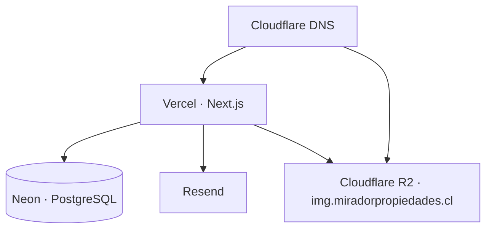

# Operación y mantenimiento — Mirador Propiedades

> Runbook de despliegue, mantenimiento y resolución de incidencias.
> Para la arquitectura del código ver [ARQUITECTURA.md](ARQUITECTURA.md); para la visión general, el [README](../README.md).

---

## Tabla de contenidos

1. [Topología de producción](#1-topología-de-producción)
2. [Despliegue inicial](#2-despliegue-inicial)
3. [Despliegue continuo](#3-despliegue-continuo)
4. [Migraciones de base de datos](#4-migraciones-de-base-de-datos)
5. [Gestión de usuarios administradores](#5-gestión-de-usuarios-administradores)
6. [Rotación de credenciales](#6-rotación-de-credenciales)
7. [Respaldos y recuperación](#7-respaldos-y-recuperación)
8. [Almacenamiento de imágenes](#8-almacenamiento-de-imágenes)
9. [Email transaccional](#9-email-transaccional)
10. [Observabilidad](#10-observabilidad)
11. [Resolución de incidencias](#11-resolución-de-incidencias)
12. [Mantenimiento periódico](#12-mantenimiento-periódico)
13. [Guía rápida para la corredora](#13-guía-rápida-para-la-corredora)

---

## 1. Topología de producción

| Componente | Proveedor | Recurso |
|---|---|---|
| Aplicación | Vercel | Proyecto conectado al repositorio, rama `main` |
| Base de datos | Neon | PostgreSQL serverless |
| Imágenes | Cloudflare R2 | Bucket con Custom Domain `img.miradorpropiedades.cl` |
| Email | Resend | Dominio remitente verificado |
| DNS | Cloudflare + Vercel | `miradorpropiedades.cl` → Vercel · `img.` → R2 |
| Mapas | OpenStreetMap | Tiles públicos, sin cuenta |



---

## 2. Despliegue inicial

### 2.1 Base de datos (Neon)

1. Crear el proyecto y la base de datos.
2. Copiar la cadena de conexión **pooled** (recomendada en serverless) para `DATABASE_URL`.
3. Aplicar el esquema desde una máquina con acceso:
   ```bash
   DATABASE_URL="<cadena-de-produccion>" npx prisma migrate deploy
   ```
4. Crear el usuario administrador (**sin** cargar propiedades de ejemplo en producción):
   ```bash
   DATABASE_URL="<prod>" SEED_ADMIN_EMAIL="…" SEED_ADMIN_PASSWORD="…" npx tsx prisma/seed.ts
   ```
   > El seed también inserta 8 propiedades de demostración. Si no las quieres en producción, crea el usuario a mano con `prisma/set-admin-password.ts` sobre una fila existente, o elimina las propiedades demo desde el panel una vez sembradas.

### 2.2 Almacenamiento (Cloudflare R2)

1. Crear el bucket.
2. Generar un API Token con permisos **Object Read & Write** y anotar `Access Key ID` y `Secret Access Key`.
3. En **Settings → Public access → Custom Domains**, conectar `img.miradorpropiedades.cl`. Cloudflare crea el registro CNAME automáticamente.
4. Anotar `R2_ACCOUNT_ID`, `R2_BUCKET_NAME` y `R2_PUBLIC_URL` (sin barra final).
5. Verificar que el hostname esté declarado en `remotePatterns` de `next.config.ts`. Si cambia el dominio de imágenes, **hay que actualizar ese archivo y redesplegar**, o `next/image` rechazará las URLs.

### 2.3 Email (Resend)

1. Verificar el dominio remitente (registros SPF y DKIM en Cloudflare DNS).
2. Generar la API key para `RESEND_API_KEY`.
3. `CONTACT_EMAIL_FROM` debe pertenecer al dominio verificado; `CONTACT_EMAIL_TO` es la casilla que recibe los leads.

### 2.4 Aplicación (Vercel)

1. Importar el repositorio. El *build command* por defecto (`npm run build`) ya ejecuta `prisma generate`.
2. Cargar en **Settings → Environment Variables** todas las variables listadas en el [README](../README.md#13-variables-de-entorno), para los entornos Production y Preview.
3. Generar `AUTH_SECRET` con `npx auth secret` — **distinto** al de desarrollo.
4. `AUTH_URL` y `NEXT_PUBLIC_SITE_URL` deben apuntar a `https://www.miradorpropiedades.cl`.
5. Configurar el dominio en **Settings → Domains** y desplegar.

### 2.5 Verificación post-despliegue

- [ ] El home carga y muestra las propiedades destacadas
- [ ] `/propiedades` filtra, ordena y pagina
- [ ] Una ficha muestra galería, mapa y (si aplica) video
- [ ] El formulario de contacto guarda la consulta **y** llega el email
- [ ] `/admin/login` autentica correctamente
- [ ] La subida de una imagen desde el admin funciona y la URL responde
- [ ] Crear una propiedad la hace aparecer en el sitio público sin esperar
- [ ] `/sitemap.xml` lista las propiedades y `/robots.txt` bloquea `/admin`
- [ ] `curl -I https://www.miradorpropiedades.cl` devuelve las cabeceras de seguridad

---

## 3. Despliegue continuo

Cada push a `main` dispara un despliegue de producción; las ramas y pull requests generan Preview Deployments.

**Antes de hacer push:**

```bash
npm run typecheck
npm run lint
npm run build
```

**Reversión.** En Vercel → **Deployments**, abrir el despliegue anterior estable y usar *Promote to Production*. Es instantáneo y no requiere rebuild.

> Cuidado: una reversión de código **no revierte migraciones de base de datos**. Si el despliegue incluía un cambio de esquema, revisa la sección siguiente antes de volver atrás.

---

## 4. Migraciones de base de datos

### Desarrollo

```bash
# tras editar prisma/schema.prisma
npm run db:migrate       # crea el SQL y lo aplica en local
npm run db:generate      # regenera el cliente tipado
```

### Producción

```bash
DATABASE_URL="<prod>" npx prisma migrate deploy
```

`migrate deploy` solo aplica migraciones pendientes; nunca resetea ni pide confirmación. Es lo que debe usarse en producción — **nunca** `migrate dev` ni `db push`.

**Reglas de oro:**

- Respaldar antes de cualquier migración destructiva.
- Preferir cambios aditivos (columnas nuevas nulables) para que la versión anterior de la app siga funcionando durante el despliegue.
- Para renombrar o eliminar columnas, hacerlo en dos despliegues: primero el código deja de usarlas, después se elimina la columna.
- Nunca editar una migración ya aplicada; crear una nueva.

**Historial actual:** `20260519012346_init` → `20260706015604_add_comercial_property_type` → `20260720023913_add_property_video`.

---

## 5. Gestión de usuarios administradores

No existe registro público: los administradores se crean por script o directamente en la base de datos.

**Cambiar la contraseña de un administrador existente:**

```powershell
# PowerShell
$env:DATABASE_URL="<prod>"; $env:ADMIN_EMAIL="alejandra@miradorpropiedades.cl"; $env:ADMIN_NEW_PASSWORD="<nueva>"; npx tsx prisma/set-admin-password.ts
```

```bash
# bash
DATABASE_URL="<prod>" ADMIN_EMAIL="alejandra@miradorpropiedades.cl" ADMIN_NEW_PASSWORD="<nueva>" npx tsx prisma/set-admin-password.ts
```

**Crear un administrador adicional:** ejecutar el seed con otro `SEED_ADMIN_EMAIL` (usa `upsert`, así que no toca al usuario existente), o insertar la fila desde Prisma Studio con un hash bcrypt generado aparte. La contraseña **nunca** se almacena en texto plano.

**Revocar el acceso de alguien:** eliminar su fila en `AdminUser`. Ten en cuenta que una sesión JWT ya emitida sigue siendo válida hasta expirar; para invalidarla de inmediato hay que rotar `AUTH_SECRET`, lo que cierra la sesión de todos los administradores.

---

## 6. Rotación de credenciales

| Credencial | Procedimiento | Efecto |
|---|---|---|
| `AUTH_SECRET` | `npx auth secret` → actualizar en Vercel → redesplegar | Cierra todas las sesiones abiertas |
| Contraseña de admin | Script `set-admin-password.ts` | Inmediato |
| API Token de R2 | Crear token nuevo → actualizar `R2_ACCESS_KEY_ID`/`R2_SECRET_ACCESS_KEY` → redesplegar → revocar el antiguo | Las imágenes ya publicadas no se ven afectadas |
| `RESEND_API_KEY` | Crear key nueva en Resend → actualizar → revocar la antigua | Solo afecta el envío |
| `DATABASE_URL` | Rotar la contraseña en Neon → actualizar → redesplegar | Requiere redespliegue |

Tras cualquier rotación, redesplegar en Vercel: las variables de entorno se inyectan en tiempo de build/arranque.

---

## 7. Respaldos y recuperación

**Base de datos.** Neon mantiene *history retention* configurable con recuperación a un punto en el tiempo. Complementar con un volcado periódico:

```bash
pg_dump "<DATABASE_URL>" --no-owner --format=custom --file=mirador-$(date +%F).dump
```

Restauración:

```bash
pg_restore --clean --no-owner --dbname="<DATABASE_URL>" mirador-2026-08-10.dump
```

**Imágenes.** R2 no versiona objetos por defecto. Para respaldar el bucket completo con `rclone` o el AWS CLI apuntando al endpoint de R2:

```bash
aws s3 sync s3://<bucket> ./backup-img \
  --endpoint-url https://<account-id>.r2.cloudflarestorage.com
```

**Código.** El repositorio Git es la fuente de verdad. Las migraciones versionadas permiten reconstruir el esquema desde cero.

> Un respaldo sin restauración probada no es un respaldo. Conviene verificar el `pg_restore` contra una base de desarrollo al menos una vez.

---

## 8. Almacenamiento de imágenes

**Límites operativos:** JPEG · PNG · WebP · AVIF, máximo 4 MB por archivo tras la compresión del navegador (tope de cuerpo de request en Vercel). Las imágenes se comprimen automáticamente a 1600 px en el lado mayor y ~1 MB antes de subir.

**Convención de claves:** `properties/<uuid>.<ext>`, generada en servidor. El nombre original del archivo nunca se usa.

**Objetos huérfanos.** Al editar una propiedad se reemplaza todo su conjunto de imágenes en base de datos, pero los objetos que dejan de referenciarse **permanecen en R2**. Limpieza manual sugerida (revisión semestral):

1. Listar las claves del bucket.
2. Listar los valores de `PropertyImage.url` en la base de datos.
3. Eliminar del bucket las claves no referenciadas.

Verifica siempre contra la base de datos de **producción** antes de borrar.

**Cambio de dominio de imágenes.** Si `R2_PUBLIC_URL` cambia, hay que: actualizar la variable, añadir el nuevo hostname a `remotePatterns` en `next.config.ts`, redesplegar y **migrar las URLs ya guardadas** en `PropertyImage.url` con un `UPDATE` de reemplazo de prefijo.

---

## 9. Email transaccional

Si dejan de llegar las consultas, revisar en este orden:

1. `RESEND_API_KEY` presente y válida en Vercel.
2. Dominio verificado en Resend (SPF/DKIM correctos en DNS).
3. `CONTACT_EMAIL_FROM` pertenece a ese dominio.
4. Logs de Resend: entregas rechazadas o marcadas como spam.
5. Logs de Vercel: mensajes con prefijo `[email]`.

**Importante:** aunque el email falle, la consulta **sí queda registrada** en la tabla `Inquiry` y es visible en `/admin/inquiries`. Ante un incidente de correo, esa bandeja es la fuente de verdad para recuperar los leads del período afectado.

---

## 10. Observabilidad

| Fuente | Qué vigilar |
|---|---|
| Vercel → Logs | Errores de runtime y logs con prefijo `[…]` de los fallbacks |
| Vercel → Analytics | Tráfico, rutas más visitadas, Core Web Vitals |
| Neon → Monitoring | Conexiones activas, latencia, uso de almacenamiento |
| Cloudflare R2 → Metrics | Volumen almacenado y operaciones |
| Resend → Logs | Entregas, rebotes, quejas |
| `/admin` | Consultas de los últimos 7 días — indicador funcional de que el formulario opera |

**Prefijos de log implementados en el código:** `[home]`, `[/propiedades]`, `[detalle]`, `[sitemap]`, `[layout]`, `[getPropertyCities]`, `[api/contact]`, `[email]`, y `R2 upload failed:`. Buscar por corchete en los logs de Vercel aísla rápido el subsistema afectado.

---

## 11. Resolución de incidencias

### El sitio carga pero no aparece ninguna propiedad

Fallo de conexión a Postgres. Los fallbacks están funcionando como se diseñó.
→ Revisar el estado de Neon, si el proyecto está suspendido por inactividad y la validez de `DATABASE_URL`. Confirmar en los logs de Vercel los mensajes `DB unavailable`.

### `Invalid src prop … hostname is not configured`

El hostname de la imagen no está en `remotePatterns`.
→ Añadirlo en `next.config.ts` y redesplegar.

### No se pueden subir imágenes desde el admin

→ Comprobar las cinco variables `R2_*` (el error de servidor nombra la que falta), la vigencia del API Token y su permiso *Object Read & Write*. Si el archivo supera 4 MB tras la compresión, reducirlo antes de subir.

### El login rechaza credenciales correctas

→ Verificar que `AUTH_SECRET` y `AUTH_URL` estén definidas en producción y que `AUTH_URL` coincida exactamente con el dominio en uso (con o sin `www` es relevante). Confirmar que el `AdminUser` existe; si hay dudas sobre la contraseña, rotarla con el script.

### Bucle de redirección en `/admin`

Suele ser desajuste entre `AUTH_URL` y el dominio real, o cookies antiguas.
→ Corregir `AUTH_URL`, redesplegar y limpiar las cookies del navegador.

### Un cambio en el admin no se refleja en el sitio público

→ Las mutaciones revalidan `/`, `/propiedades` y la ficha. Si el cambio afecta otra ruta, esperar el TTL de 300 s o añadir el `revalidatePath` correspondiente en `actions.ts`.

### El mapa no aparece en la ficha

→ La sección solo se renderiza si la propiedad tiene `lat` **y** `lng`. Fijar la ubicación desde el admin.

### El video no se muestra

→ `parseVideoUrl()` devolvió `null`: el enlace no es de YouTube ni de Vimeo, o tiene un formato no soportado. El formulario lo rechaza al guardar; usar un enlace canónico de la plataforma.

### Error de build por `prisma generate`

→ Verificar que `DATABASE_URL` esté presente en el entorno de build y que las migraciones estén aplicadas. El script `build` ejecuta `prisma generate` antes de compilar.

---

## 12. Mantenimiento periódico

| Frecuencia | Tarea |
|---|---|
| Semanal | Revisar la bandeja de consultas y responder los leads |
| Mensual | Revisar logs de errores en Vercel; verificar que llegan los correos de contacto |
| Trimestral | `npm outdated` y actualización de dependencias menores; volver a correr `typecheck`, `lint` y `build` |
| Trimestral | Volcado de base de datos y verificación de la restauración |
| Semestral | Limpieza de imágenes huérfanas en R2 |
| Semestral | Rotación de API keys (R2, Resend) |
| Anual | Revisión de versiones mayores (Next.js, React, Prisma) en una rama aparte |

---

## 13. Guía rápida para la corredora

**Publicar una propiedad**

1. Entrar a `miradorpropiedades.cl/admin` con tu email y contraseña.
2. **Propiedades → Nueva propiedad**.
3. Completar título, operación (venta/arriendo), tipo, precio y moneda (CLP o UF) y comuna.
4. **Ubicación**: la vía más simple es abrir Google Maps, copiar el enlace del lugar y pegarlo en el campo correspondiente — el pin se posiciona solo. También puedes hacer clic o arrastrar el pin directamente en el mapa.
5. Completar dormitorios, baños, estacionamientos, bodega y superficies.
6. Escribir la descripción (mínimo 20 caracteres; se respetan los saltos de línea).
7. Opcional: pegar el enlace de YouTube o Vimeo del recorrido.
8. **Imágenes**: arrastrarlas al recuadro. Se comprimen y suben solas. **Cada imagen necesita un texto alternativo** — una frase breve que describa la foto («Living con ventanal al lago»). Es obligatorio para accesibilidad y ayuda al posicionamiento en Google.
9. Marcar **Destacada** si quieres que aparezca en la portada.
10. **Crear propiedad**. El sitio público se actualiza al instante.

**Cambiar el estado de una propiedad.** Editarla y ajustar el estado: *Disponible* y *Reservada* siguen visibles en el catálogo; *Vendida* y *Arrendada* dejan de mostrarse en el listado por defecto pero conservan su historial y sus consultas.

**Ver las consultas.** En **Consultas** está el listado completo con nombre, email, teléfono, mensaje y la propiedad asociada. El email y el teléfono son clicables para responder directo.

**Buenas prácticas**

- Sube entre 5 y 12 fotos horizontales por propiedad; la primera es la portada.
- Escribe títulos que incluyan tipo y comuna («Casa en parcela, Frutillar»): así queda mejor la URL y el posicionamiento.
- Mantén entre 4 y 6 propiedades destacadas; más satura la portada.
- Antes de eliminar una propiedad, considera marcarla como *Vendida*: eliminarla borra también sus fotos y desvincula sus consultas, y **no se puede deshacer**.
